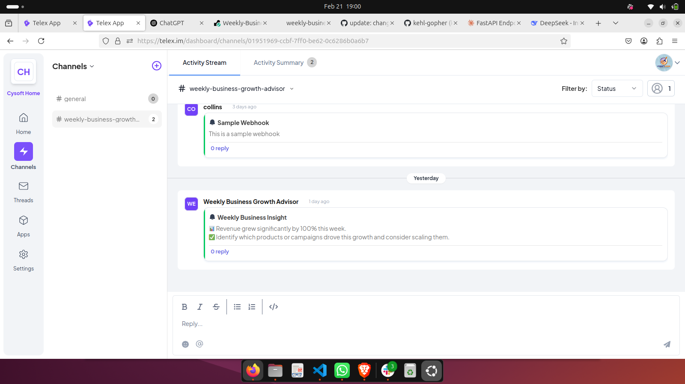
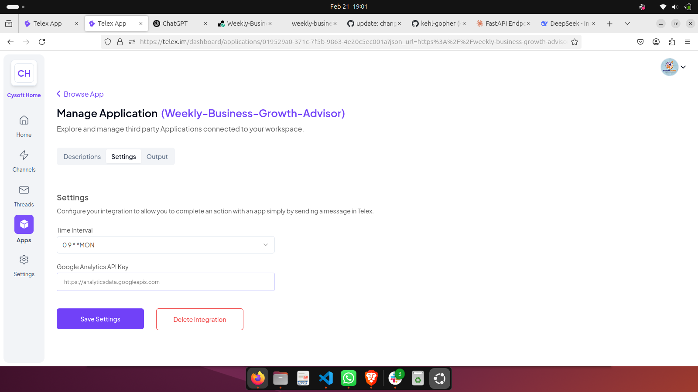

# Weekly Business Growth Advisor - Telex Integration

## 📌 Overview
The Weekly Business Growth Advisor is a Telex Interval Integration that analyzes key business metrics and provides a weekly actionable tip to improve business performance. Every Monday morning, it suggests one data-driven improvement based on trends such as sales, customer engagement, marketing reach, and financial performance.

## 🚀 Features
- Fetches business performance data from connected services (Stripe, Google Analytics, HubSpot)
- Analyzes week-over-week trends to identify growth opportunities
- Generates specific, actionable business advice based on data patterns
- Posts a concise weekly report with metrics summary and one key recommendation
- Configurable threshold settings for alerts on significant metric changes

## 🛠️ Installation

### Prerequisites
- Python 3.8+
- A Telex organization account
- API credentials for your business services (Stripe, Google Analytics, etc.)

### Setup Steps
1. **Clone the repository**:
   ```bash
   git clone https://github.com/telexorg/weekly-business-advisor.git
   cd weekly-business-advisor
   ```

2. **Install dependencies**:
   ```bash
   pip install -r requirements.txt
   ```

3. **Configure environment variables**:
   Create a `.env` file in the root directory with your API credentials:
   ```
   STRIPE_API_KEY=sk_test_...
   GA_SERVICE_ACCOUNT_KEY_PATH=./credentials/ga-key.json
   HUBSPOT_API_KEY=...
   ```

4. **Run the FastAPI server**:
   ```bash
   uvicorn app.main:app --reload
   ```

5. **Test the integration locally**:
   ```bash
   pytest
   ```

## ⚙️ Configuration

In your Telex channel, configure the integration with the following parameters:

```json
{
  "name": "Weekly Business Growth Advisor",
  "description": "Provides weekly actionable business growth tips based on your metrics",
  "version": "1.0.0",
  "author": "Your Name",
  "repository": "https://github.com/telexorg/weekly-business-advisor",
  "category": "business",
  "integrationType": "interval",
  "integration_category": "Data Analytics & Visualization",
  "configurationSchema": {
    "type": "object",
    "required": ["dataSourcesEnabled", "scheduledDay", "alertThreshold"],
    "properties": {
      "dataSourcesEnabled": {
        "type": "object",
        "title": "Data Sources",
        "properties": {
          "stripe": {
            "type": "boolean",
            "title": "Stripe",
            "default": true
          },
          "googleAnalytics": {
            "type": "boolean",
            "title": "Google Analytics",
            "default": true
          },
          "hubspot": {
            "type": "boolean",
            "title": "HubSpot",
            "default": false
          }
        }
      },
      "scheduledDay": {
        "type": "string",
        "title": "Scheduled Day",
        "description": "Day of the week to receive advice",
        "enum": ["Monday", "Tuesday", "Wednesday", "Thursday", "Friday"],
        "default": "Monday"
      },
      "alertThreshold": {
        "type": "number",
        "title": "Alert Threshold (%)",
        "description": "Percentage change that triggers special alerts",
        "minimum": 5,
        "maximum": 50,
        "default": 15
      }
    }
  },
  "target_url": "settings.TARGET_URL",
  "tick_url": "settings.Tick_URL"
}
```

## 📊 Integration in Action

Here's how the integration appears in a Telex channel:




## 🧠 How It Works

1. **Data Collection**: Every weekend, the integration fetches data from your connected business services
2. **Trend Analysis**: Our algorithm compares current metrics with historical data
3. **Insight Generation**: Based on the analysis, one high-impact recommendation is generated
4. **Delivery**: Monday morning, a concise report is posted to your configured Telex channel

## 🔄 API Endpoints

- `POST /webhook` - Receives scheduled triggers from Telex
- `GET /health` - Health check endpoint
- `POST /test-message` - Test endpoint to generate a sample advisor message

## 🧪 Testing

Run the test suite to verify functionality:

```bash
# Run all tests
pytest

# Run specific test modules
pytest tests/test_data_analysis.py
```

## 🔒 Security Considerations

- All API keys are stored securely and never logged
- Data is processed locally and not stored permanently
- HTTPS is enforced for all connections
- Rate limiting is implemented to prevent abuse

## 🤝 Contributing

1. Fork the repository
2. Create your feature branch (`git checkout -b feature/amazing-feature`)
3. Commit your changes (`git commit -m 'feat: add amazing feature'`)
4. Push to the branch (`git push origin feature/amazing-feature`)
5. Open a Pull Request

## 📝 License

This project is licensed under the MIT License - see the [LICENSE](LICENSE) file for details.